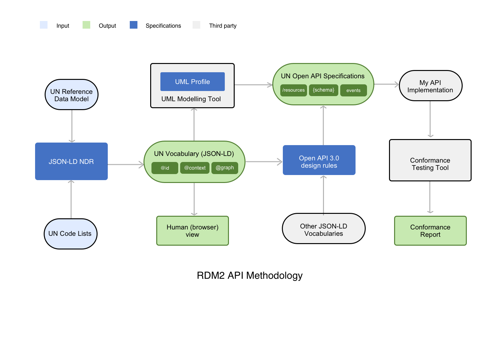

# Tools and Methods

UN/CEFACT standards such as the [Core Component Library](https://www.unece.org/cefact/codesfortrade/unccl/ccl_index.html) and various code lists are used to create the standard EDIFACT documents and XML schema that have been successfully used to support interoperable systems in the international supply chain for decades. The proliferation of the use of JSON (JavaScript Object Notation) APIs (Application Programming Interfaces) offers an opportunity to API implemeters with some semantics standards that will support interoperability between API implementations in the supply chain. APIs will have a different shape (generally more fine grained) than traditional EDIFACT documents and XML messages but can nevertheless be built upon the same semantic dictionary.

This suite of specifications defines a repeatable methodology to publish UN/CEFACT data models and code lists as JSON-LD vocabularies so that the rich supply chain semantics from UN are available for use by web developers. In additon, we provide guidance and a UML profile to help API designers leverage the standard vocabulary in the design of their API specifications. This will allow business subject matter experts and/or information modellers to quickly and consistently generate high quality API specifications that leverage existing semantic libraries.

We hope that the value of these specifications will not be limited to UN/CEFACT project teams. The specifications should be re-usable by any design team that needs to develop REST API specifications that leverage some existing library of definitions. 

## Overview of Methodology Specifications.

The diagram below shows the relationships between the methodology specifications (dark blue), the semantic library inputs (light blue), the outputs (green) and implementer systems (grey).

An API designer would use conformant modelling tools as follows.

* Import JSON-LD vocabularies such as UN/CEFACT RDM.
* Define web resources and their state lifecycles using simple UML class and state-chart diagrams. 
* Link relevant semantic definitions from the imported RDMs to the web resources.
* Generate Open API 3.0 soecifciations.

Implementers that wish to build APIs that conform with UN/CEFACT standards would choose between two conformance levels

* dictionary conformance means that the API uses terms from the JSON-LD vocabulary.  In essence, the structure or behaviour of the interface is not standard but the data elements in the interface are drawn from a UN standard JSON-LD vocabulary. 
* interface conformance means that the API is an implementaiton of a UN standard open API specification.  

## JSON-LD NDR & Conformance Rules  

JSON-LD is the normative format for publishing UN/CEFACT semantics.  The Naming & Design Rules (NDR) specify the mapping rules for publishing JSON-Ld vocabularies from two types of UN/CEFACT sources

* Reference Data Models (RDM) such as the buy-ship-pay (BSP) model or multi-modal-transport (MMT) model.
* Code lists such as UN/Locode location codes or Rec 20 units of measure codes.

This is the foundation specification that makes UN/CEFACT semantics accessible and consumable for web developers. This specification will have achieved it's purpose when UN semantics are published and consumable in a similar way to other well established vocabularies such as schema.org.

## UML Profile

Designing good quality API specifications is as much a business exercise as a technical one. Data modelling tools such as UML tools provide a powerful way to visualise both the structureal and behavioural aspects of an interface. Although, of course, API designers may develop API specifications based on the pubnlished vocabulary using any tool including a simple text editor, visual modelling tools are a powerful way for business domain experts to design high quality APIs. 

For different UML tools to be able to import vocabularies, model interfaces, and generate API specifications in a consistent and interoperable way, it is important to define a UML profile for Open API 3.0 - using two types of UML diagrams.

* A UML class diagram profile for web resources, verbs, paths, and associated definitions.  
* A UML state chart profile for web resource state lifecycles and events.

This specification will have achieved it's purpose when different data modellers using different UML tools can succesfully interchange their models and can consistently generate the same Open API 3.0 specification from the same UML model.

## Open API3.0 Design Rules 

The [Open API 3.0](http://spec.openapis.org/oas/v3.0.3) technical specification says how to represent an API description in a machine readable way. It does not say how to design a high quality API or what design best practices and principles should be applied. The purpose of this specification is to define a set of design rules so that business modellers will consistenly deliver high quality API designs.

